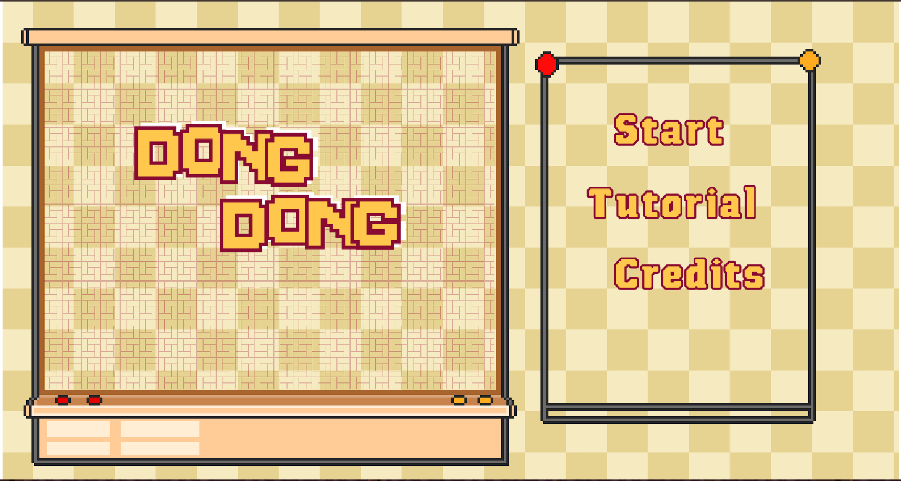
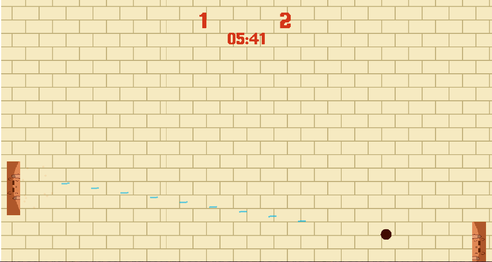
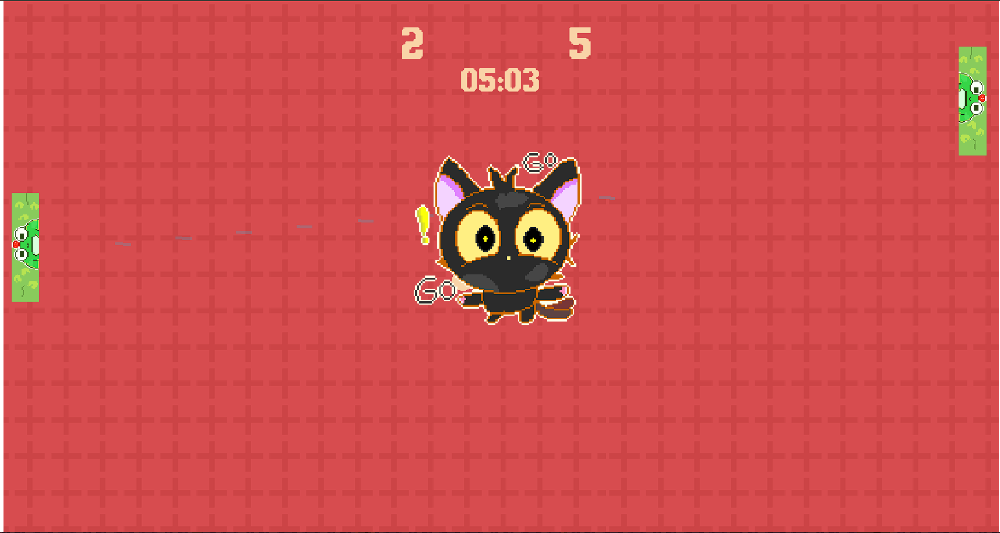
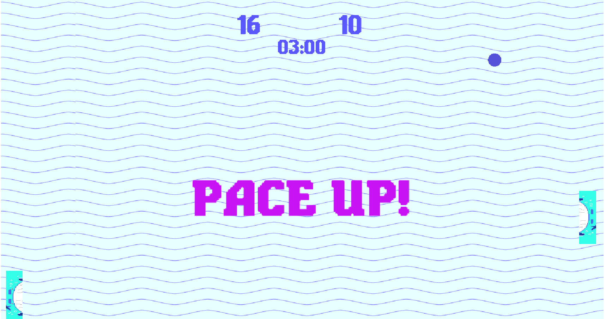
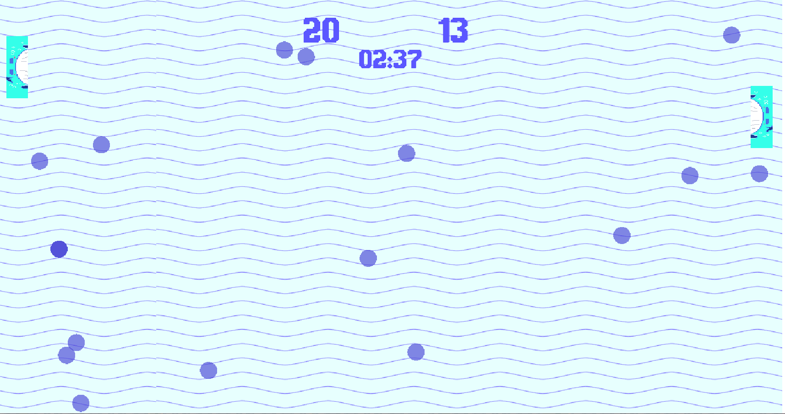
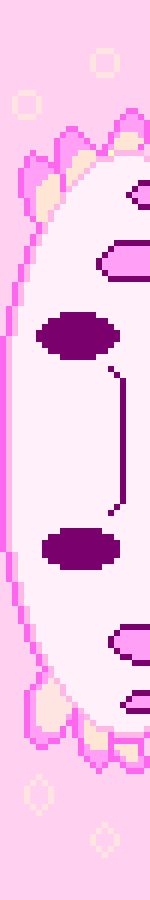
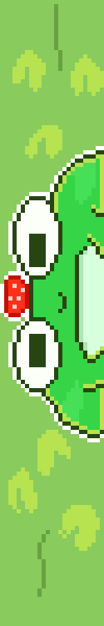

<div align="center">

# 🎮 DongDong

**Neo Pong Game**

A modern reinterpretation of classic Pong.

[About](#about) • [Features](#key-features) • [Media](#screenshots--footage) • [Run Locally](#how-to-run-locally)

</div>

---

## About

**DongDong** is a fast-paced arcade game inspired by the classic Pong,  
rebuilt with modern game feel, escalating tension, and skill-based mechanics.

The goal stays simple:  
**outscore your opponent before time runs out.**

---

## Key Features

- **Pace Up System**  
  The match gets faster over time:  
  smaller paddles, faster movement, faster balls, and rising tension.

- **Burst Mechanic**  
  A high-risk dash that can launch the ball at extreme speed when timed correctly.

- **Decoy Ball Phase**  
  Multiple fake balls appear to distract both player and AI.  
  Only one ball scores.

- **Adaptive AI Opponent**  
  The AI reacts with delay, makes mistakes, and occasionally performs Burst moves,  
  creating believable and exciting rallies.

---

## Screenshots & Footage

### Gameplay Footage

<div align="center">
  <br><br>
  <br><br>
  <br><br>
  <br><br>
  
</div>

### Discover 4 Random Themes

<div align="center">
  <br><br>
  <br><br>
  <br><br>
  
</div>

---

## How to Run Locally

1. Clone the repository:
   ```bash
   git clone https://github.com/nabeellagi/DongDong.git


## How to Run Locally

1. Clone the repository:
   `bash
   git clone https://github.com/nabeellagi/DongDong.git
`

2. Install dependencies:
   `bash
   npm install
`

3. Run the development server:

   `bash
   npm run dev
   `

4. Open the game in your browser and start playing.

---

Made for **Milkyway Hackathon** by Hack Club
